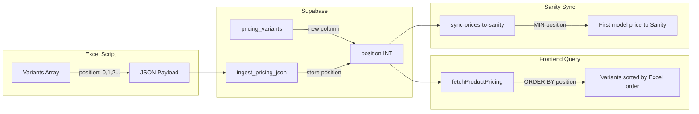

# Excel Row Order Priority for Pricing Models

## Problem Summary

Currently, product models are ordered by **lowest price first** throughout the system. You want models to appear in **Excel spreadsheet order** instead - the first model in Excel should be the default in dropdowns and synced to Sanity.

## Architecture Changes




## Implementation Steps

### 1. Add `position` column to `pricing_variants` table

Run a Supabase migration to add the column:

```sql
ALTER TABLE public.pricing_variants 
ADD COLUMN position INTEGER NOT NULL DEFAULT 0;
```


### 2. Update Excel Script to send position

Modify the `readProdukty` function in your TypeScript script to track row index as position:

```typescript
// In readProdukty function
let position = 0;
for (let i = CONFIG.DATA_START_ROW_PRODUKTY; i < data.length; i++) {
    // ... existing logic ...
    variants.set(variantKey(product, model || null), {
        // ... existing fields ...
        position: position++,  // ADD THIS
        groups: [],
    });
}
```

Also add `position` to the `Variant` interface.

### 3. Update `ingest_pricing_json` RPC function

Modify the PostgreSQL function to:

- Accept `position` from JSON payload
- Store it in `pricing_variants` table
- Use position for deduplication ordering (prefer lowest position instead of highest idx)

Key changes in SQL:

```sql
-- In tmp_variants_dedup creation
position int,

-- In INSERT
coalesce((v->>'position')::int, idx::int) as position,

-- Change ORDER BY from idx DESC to position ASC
ORDER BY v->>'price_key', COALESCE(NULLIF(v->>'model', ''), ''), 
         coalesce((v->>'position')::int, idx::int) ASC;

-- In UPSERT to pricing_variants
position = EXCLUDED.position
```


### 4. Update frontend query in [`apps/web/src/app/produkty/[slug]/page.tsx`](apps/web/src/app/produkty/[slug]/page.tsx)

Change the Supabase query in [`apps/web/src/global/supabase/queries.ts`](apps/web/src/global/supabase/queries.ts) from:

```typescript
.order('base_price_cents', { ascending: true });
```

to:

```typescript
.order('position', { ascending: true });
```


### 5. Update `sync-prices-to-sanity` Edge Function

Change from "lowest price" to "lowest position" (first in Excel):

```typescript
// Current: finds lowest price
if (current === undefined || v.base_price_cents < current) {
    productPriceMap.set(slug, v.base_price_cents);
}

// New: track position and pick lowest position's price
const entry = productPriceMap.get(slug);
if (!entry || v.position < entry.position) {
    productPriceMap.set(slug, { price: v.base_price_cents, position: v.position });
}
```


## Files to Modify

| File | Change ||------|--------|| Excel TypeScript Script | Add `position` field to Variant interface and track row index || Supabase Migration | Add `position` column to `pricing_variants` || `ingest_pricing_json` RPC | Accept and store position, order by position || [`apps/web/src/global/supabase/queries.ts`](apps/web/src/global/supabase/queries.ts) | Order by `position` instead of `base_price_cents` || `sync-prices-to-sanity` Edge Function | Pick price by lowest position, not lowest price |

## Rollout Order

1. Add database column (backwards compatible - default 0)
2. Update RPC function to store position
3. Update Excel script to send position